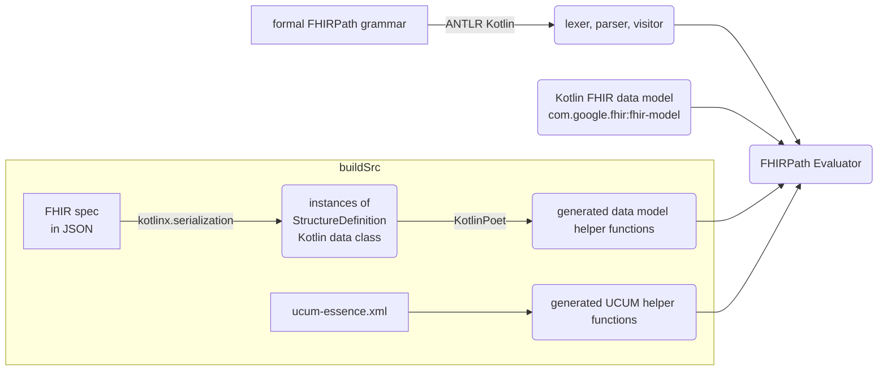

# Kotlin FHIRPath

[](https://maven.google.com/web/index.html?#com.google.fhir:fhir-path)
[](https://maven.google.com/web/index.html?#com.google.fhir:fhir-path-android)
[](https://maven.google.com/web/index.html?#com.google.fhir:fhir-path-iosarm64)
[](https://maven.google.com/web/index.html?#com.google.fhir:fhir-path-iossimulatorarm64)
[](https://maven.google.com/web/index.html?#com.google.fhir:fhir-path-iosx64)
[](https://maven.google.com/web/index.html?#com.google.fhir:fhir-path-js)
[](https://maven.google.com/web/index.html?#com.google.fhir:fhir-path-jvm)
[](https://maven.google.com/web/index.html?#com.google.fhir:fhir-path-wasm-js)
[](https://maven.google.com/web/index.html?#com.google.fhir:fhir-path-wasm-wasi)
[](https://opensource.org/licenses/Apache-2.0)

Kotlin FHIRPath is an implementation of [HL7® FHIR®](https://www.hl7.org/fhir/overview.html)'s
[FHIRPath](https://hl7.org/fhirpath/N1/) on
[Kotlin Multiplatform](https://kotlinlang.org/docs/multiplatform.html).

**Warning:** The library is in alpha and subject to change. Use at your own risk.

## Key features

* Built with an [ANTLR](https://www.antlr.org/)-generated parser for strict adherence to the formal
  FHIRPath grammar
* Conforms strictly to the specification, with predictable and well-documented behavior
* Support for validation, conversion, and comparison between compatible
  [UCUM](http://unitsofmeasure.org/ucum.html) units
* Designed for portability, providing a single engine across JVM, Android, iOS, Web (JS), and Native
  platforms
* Tested against the official [FHIR test cases](https://github.com/FHIR/fhir-test-cases) to
  guarantee correctness

## FHIRPath version support

The implementation is based on the [FHIRPath Normative Release](https://hl7.org/fhirpath/N1/).
However, we also incorporate some of the latest features and clarifications from the
[Continuous Build](https://build.fhir.org/ig/HL7/FHIRPath/) wherever feasible. Please note the
experimental nature of the sections marked as STU (Standard for Trial Use) in the Continuous Build.

## FHIR version support

The library currently supports R4 only. Support for other versions will be added as the library
matures.

## Implementation

This project uses [ANTLR Kotlin](https://github.com/Strumenta/antlr-kotlin) to generate the
lexer, parser and visitor directly from the formal FHIRPath grammar. This automated approach ensures
correctness, improves maintainability, and significantly reduces development time.

The
[FHIRPath Evaluator](fhirpath/src/commonMain/kotlin/com/google/fhir/fhirpath/FhirPathEvaluator.kt)
implements the visitor class generated by ANTLR, evaluating FHIRPath expressions by traversing the
in-memory data model from the [Kotlin FHIR](https://github.com/google/kotlin-fhir) library.

A key requirement for FHIRPath evaluation is the capability to access data elements by name. To
achieve this with cross-platform compatibility (avoiding reflection), a codegen embedded in
`buildSrc` generates helper functions to the Kotlin FHIR data model.



*Figure 1: Architecture diagram*

The following table lists the chosen internal types for the FHIRPath primitive types.

| FHIRPath type  | Internal type  |
|-----------------------------------------------------------------------------|-------------------------------------------------------------------------------|
| Boolean                                                                     | kotlin.Boolean                                                                |
| String                                                                      | kotlin.String                                                                 |
| Integer                                                                     | kotlin.Int                                                                    |
| Long                                                                        | kotlin.Long                                                                   |
| Decimal                                                                     | com.ionspin.kotlin.bignum.decimal.BigDecimal                                  |
| Date                                                                        | FhirDate(*)                                                                   |
| DateTime                                                                    | FhirPathDateTime(**)                                                          |
| Time                                                                        | FhirPathTime(**)                                                              |
| Quantity                                                                    | Quantity(*)                                                                   |

(*): Classes defined in [Kotlin FHIR](https://github.com/google/kotlin-fhir)
(**): Classes defined in this project

Classes from the [Kotlin FHIR](https://github.com/google/kotlin-fhir) are used for more complex
types that do not have direct representations in Kotlin. For DateTime and Time, the requirements in
FHIRPath are more lenient than in the FHIR specification. As a result, custom classes need to be
authored to handle cases where the minutes, seconds, or milliseconds are not present (allowed in
FHIRPath but not allowed in FHIR).

### Timezone offset in date time values

This FHIRPath implementation adopts a strict, safety-first approach to date time comparisons,
especially around the handling of timezones and date time values with different precisions.

#### Date time values without timezone offset

The FHIRPath specification allows implementations to provide a default timezone offset for date time
values that do not have one. See the relevant sections on
[equality](https://hl7.org/fhirpath/N1/#datetime-equality),
[equivalence](https://hl7.org/fhirpath/N1/#datetime-equivalence), and
[comparison](https://hl7.org/fhirpath/N1/#comparison).

To prioritise safety and correctness, when comparing date time values without a timezone offset with
date time values with a timezone offset, this implementation **does not assume a default timezone
offset** (such as UTC or the system's timezone offset). This is because the data could have
originated from a different system or context unknown to this implementation, making any "guess"
potentially incorrect and unsafe.

This leads to the following behavior:
- Equality (`=`, `!=`) and comparison (`<=`, `<`, `>`, `>=`) operators will return an empty result
`{}` to indicate uncertainty
- Equivalence (`~`) operator will return `false` since equivalence cannot be proven. Likewise, `!~`
will return `true`.

```
@2025-01-01T00:00:00.0+00:00 = @2025-01-01T00:00:00.0  // returns {} 
@2025-01-01T00:00:00.0+00:00 ~ @2025-01-01T00:00:00.0  // returns false
@2025-01-01T00:00:00.0+00:00 > @2025-01-01T00:00:00.0  // returns {}
```

> **Note:** While comparing two date time values without timezone offset, the implementation will
> treat them as if they had the same timezone offset. This compromise is made so that local date
> time values can be compared:
>
> ```
> @2025-01-01T00:00:00.0 = @2025-01-01T00:00:00.0`  // returns true
> ```

#### Date time values with timezone offsets but different precisions

According to the specification, two date time values should be compared at each precision, starting
from years all the way to seconds. However, this becomes problematic when the date time values at
hourly precision have half-hour or quarter-hour timezone offsets. Consider `@2025-01-01T00+05:30`
and `@2025-01-01T00+05:45`. In no timezone can both values still be represented as partial date time
values at the same precision in order to carry out the comparison algorithm.

Whilst it is possible to implement
[precision based timing in CQL](https://cql.hl7.org/05-languagesemantics.html#precision-based-timing)
using intervals, it is not part of the FHIRPath specification. For simplicity, this implementation
**returns an empty result for comparing partial date time values with timezone offsets**.

```
// Indian Standard Time (IST) and Nepal Time (NPT)
@2025-01-01T00+05:30 = @2025-01-01T00+05:45   // returns {}
```

## Conformance

Due to the library's WIP status, not all test cases from the published official test suites are
passing. The failures are documented in the table below.

|              Test case               |     Root cause     | STU |                  Tracking issue / PR                   |                                                                                  Note                                                                                   |
|--------------------------------------|--------------------|-----|--------------------------------------------------------|-------------------------------------------------------------------------------------------------------------------------------------------------------------------------|
| `testPolymorphismAsB`                | Test               |     | To be raised                                           | No error should be thrown according to [specification](https://hl7.org/fhirpath/#as-type-specifier).                                                                    |
| `testDateTimeGreaterThanDate1`       | Implementation     |     |                                                        | Comparison of two date time values, one with a timezone offset one without; see [Date time values without timezone offset](#date-time-values-without-timezone-offset)   |
| `testStringIntegerLiteralToQuantity` | Specification/Test |     |                                                        | [Discussion](https://chat.fhir.org/#narrow/channel/179266-fhirpath/topic/Quantity.20and.20Decimal/near/543270110)                                                       |
| `testQuantityLiteralWkToString`      | Specification/Test |     |                                                        | As above.                                                                                                                                                               |
| `testQuantityLiteralWeekToString`    | Specification/Test |     |                                                        | As above.                                                                                                                                                               |
| `testQuantity4`                      | Test               |     | [PR](https://github.com/FHIR/fhir-test-cases/pull/243) |                                                                                                                                                                         |
| `testSubSetOf3`                      | Specification/Test |     |                                                        | The test resource is invalid and missing (https://github.com/FHIR/fhir-test-cases/issues/247); the scope of "$this" is unclear (https://jira.hl7.org/browse/FHIR-44601) |
| `testDistinct2`                      | Implementation     |     |                                                        | Function `descendants` is not implemented.                                                                                                                              |
| `testDistinct3`                      | Implementation     |     |                                                        | As above.                                                                                                                                                               |
| `testDistinct5`                      | Implementation     |     |                                                        | As above.                                                                                                                                                               |
| `testDistinct6`                      | Implementation     |     |                                                        | As above.                                                                                                                                                               |
| `testRepeat*`                        | Implementation     |     |                                                        | Function `repeat` is not implemented.                                                                                                                                   |
| `testAggregate*`                     | Implementation     |     |                                                        | Function `aggregate` is not implemented.                                                                                                                                |
| `testIif11`                          | Implementation     |     |                                                        | https://jira.hl7.org/browse/FHIR-44774; https://jira.hl7.org/browse/FHIR-44601                                                                                          |
| `testEncode*`                        | Implementation     | STU |                                                        | Function `encode` is not implemented.                                                                                                                                   |
| `testDecode*`                        | Implementation     | STU |                                                        | Function `decode` is not implemented.                                                                                                                                   |
| `testEscape*`                        | Implementation     | STU |                                                        | Function `escape` is not implemented.                                                                                                                                   |
| `testUnescape*`                      | Implementation     | STU |                                                        | Function `unescape` is not implemented.                                                                                                                                 |
| `testTrace*`                         | Implementation     |     |                                                        | Function `trace` is not implemented.                                                                                                                                    |
| `testNow1`                           | Specification/Test |     |                                                        | As `testDateTimeGreaterThanDate1`.                                                                                                                                      |
| `testSort*`                          | Specification/Test |     |                                                        | Function `sort` is not defined in the specification.                                                                                                                    |
| `testCombine*`                       | Implementation     |     |                                                        | Function `combine` is not implemented.                                                                                                                                  |
| `testPlusDate13`                     | Specification/Test |     |                                                        | https://chat.fhir.org/#narrow/channel/179266-fhirpath/topic/Definite.20durations.20above.20seconds.20in.20date.20time.20arithmetic/with/564095766                       |
| `testPlusDate15`                     | Specification/Test |     |                                                        | As above.                                                                                                                                                               |
| `testPlusDate18`                     | Implementation     |     |                                                        | To be fixed together with `testPlusDate13`, `testPlusDate15`, `testPlusDate21`, `testPlusDate22` for a consistent implementation.                                       |
| `testPlusDate19`                     | Implementation     |     |                                                        | To be fixed together with `testPlusDate13`, `testPlusDate15`, `testPlusDate21`, `testPlusDate22` for a consistent implementation.                                       |
| `testPlusDate20`                     | Implementation     |     |                                                        | To be fixed together with `testPlusDate13`, `testPlusDate15`, `testPlusDate21`, `testPlusDate22` for a consistent implementation.                                       |
| `testPlusDate21`                     | Specification/Test |     |                                                        | As `testPlusDate13`.                                                                                                                                                    |
| `testPlusDate22`                     | Specification/Test |     |                                                        | As `testPlusDate13`.                                                                                                                                                    |
| `testMinus5`                         | Implementation     |     |                                                        | As `testPlusDate13`.                                                                                                                                                    |
| `testPrecedence3`                    | Implementation     |     |                                                        |                                                                                                                                                                         |
| `testPrecedence4`                    | Implementation     |     |                                                        |                                                                                                                                                                         |
| `testPrecedence6`                    | Implementation     |     |                                                        |                                                                                                                                                                         |
| `testVariables*`                     | Implementation     |     |                                                        | Variables are not implemented.                                                                                                                                          |
| `testExtension*`                     | Implementation     |     |                                                        | Function `extension` is not implemented.                                                                                                                                |
| `testType*`                          | Implementation     |     |                                                        | Function `type` is not implemented.                                                                                                                                     |
| `testConformsTo*`                    | Implementation     |     |                                                        | Function `conformsTo` is not implemented.                                                                                                                               |
| `LowBoundary*`                       | Implementation     | STU |                                                        | Function `lowBoundary` is not implemented.                                                                                                                              |
| `HighBoundary*`                      | Implementation     | STU |                                                        | Function `highBoundary` is not implemented.                                                                                                                             |
| `Comparable*`                        | Implementation     |     |                                                        | Function `comparable` is not implemented.                                                                                                                               |
| `Precision*`                         | Implementation     |     |                                                        | Function `precision` is not implemented.                                                                                                                                |
| `testIndex`                          | Implementation     |     |                                                        | `$index` is not implemented.                                                                                                                                            |
| `testPeriodInvariantOld`             | Implementation     |     |                                                        | Function `hasValue` is not implemented.                                                                                                                                 |
| `testPeriodInvariantNew`             | Implementation     |     |                                                        | Function `lowBoundary` and function `highBoundary` are not implemented.                                                                                                 |
| `testFHIRPathIsFunction*`            | Implementation     |     |                                                        |                                                                                                                                                                         |
| `testFHIRPathAsFunction*`            | Implementation     |     |                                                        |                                                                                                                                                                         |
| `testContainedId`                    | Implementation     |     |                                                        |                                                                                                                                                                         |

The root cause column documents if the test failure is caused by issues with the implementation
(this repository), the [tests](https://github.com/FHIR/fhir-test-cases), the specification itself,
or is under investigation. We exclude test cases that would fail due to issues in the tests and the
specification itself. But we track the ongoing discussions and resolutions in this table.

## User Guide

### Adding the library dependency to your project

To use Kotlin FHIRPath, add it to the dependencies in your project. To do that, first make sure to
include the [Google Maven](https://maven.google.com/) repository in the `build.gradle.kts` file in
your project root.

```
// build.gradle.kts
repositories {
    // Other repositories such as mavenCentral() and gradlePluginPortal()
    google()
}
```

Next, follow the instructions for your specific project type.

#### Kotlin Multiplatform Projects

For Kotlin Multiplatform projects, add the dependency to the shared `commonMain` source set within
the `kotlin` block of the module's `build.gradle.kts` file (e.g., `composeApp/build.gradle.kts` or
`shared/build.gradle.kts`). This makes the library available across all platforms in your project.

```
// e.g., composeApp/build.gradle.kts or shared/build.gradle.kts
kotlin {
    sourceSets {
        commonMain.dependencies {
            implementation("com.google.fhir:fhir-path:1.0.0-alpha02")
        }
    }
}
```

#### Android projects

For Android projects, add the dependency to the `dependency` block in the module's
`build.gradle.kts` file (e.g., `app/build.gradle.kts`).

```
// e.g., app/build.gradle.kts
dependencies {
    implementation("com.google.fhir:fhir-path:1.0.0-alpha02")
}
```

### Evaluating FHIRPath expressions

To evaluate a FHIRPath expression, use `evaluateFhirPath` function:

```
import com.google.fhir.fhirpath.evaluateFhirPath
import com.google.fhir.model.r4.FhirR4Json

val patientExampleJson = ... // Load "patient-example.json"
val patient = FhirR4Json().decodeFromString(patientExampleJson)
val results = evaluateFhirPath("name.given", patient)  // ["Peter", "James", "Jim", "Peter", "James"]
```

## Developer Guide

### ANTLR

To generate the lexer, parser, and visitor locally using ANTLR Kotlin:

```shell
./gradlew generateKotlinGrammarSource
```

The generated code will be placed in `fhir-path/build/generated` under package
`com.google.fhir.fhirpath.parsers`.

### Model extensions

To run the model extension codegen in `buildSrc` locally:

```shell
./gradlew generateR4Helpers
```

The generated code will be located in `fhir-path/build/generated` under packages
`com.google.fhir.fhirpath` and `com.google.fhir.fhirpath.ext`.

### UCUM helpers

To run the UCUM helper codegen in `buildSrc` locally:

```shell
./gradlew generateUcumHelpers
```

The generated code will be located in `fhir-path/build/generated` under package
`com.google.fhir.fhirpath.ucum`.

### Dependencies

Dependencies must be kept in sync between the
[`buildSrc/build.gradle.kts`](buildSrc/build.gradle.kts) file and the
[`gradle/libs.versions.toml`](gradle/libs.versions.toml) file. The former cannot use the latter
since the `buildSrc` directory is precompiled separately in Gradle.

### Tests

[XmlUtil](https://github.com/pdvrieze/xmlutil) is used to load the XML test cases from the
`third_party` directory. To run the tests:

```shell
./gradlew :fhir-path:jvmTest
```

The number of passing test cases is displayed on a badge at the top of this page.

### Publishing

To create a maven repository from the generated FHIR model, run:

```
./gradlew :fhir-path:publish
```

This will create a maven repository in the `fhir-path/build/repo` directory with artifacts for all
supported platforms.

To zip the repository, run:

```
./gradlew :fhir-path:zipRepo
```

This will generate a `.zip` file in the `fhir-path/build/repoZip` directory.

### Third Party

The [third_party](third_party/) directory includes resources from the FHIRPath specification and related
repositories for code generation and testing purposes:

- [`fhir-test-cases`](third_party/fhir-test-cases/): content from the
  [fhir-test-cases](https://github.com/FHIR/fhir-test-cases) repo
  - [`tests-fhir-r4.xml`](third_party/fhir-test-cases/r4/tests-fhir-r4.xml): R4 test cases
    ([commit](https://github.com/FHIR/fhir-test-cases/blob/dc86fa6f5225ac27b42046bb3ba2254ff688d3df/r4/fhirpath/tests-fhir-r4.xml))
  - [`resources`](third_party/fhir-test-cases/r4/resources) JSON versions of the relevant test
    resources generated using [Anton V.](https://www.antvaset.com/)'s
    [FHIR Converter](https://www.antvaset.com/fhir-converter) alongside the XML versions
    ([commit](https://github.com/FHIR/fhir-test-cases/tree/dc86fa6f5225ac27b42046bb3ba2254ff688d3df/r4))
- [`fhirpath-2.0.0`](third_party/fhirpath-2.0.0/): the formal
  [antlr grammar](https://hl7.org/fhirpath/N1/grammar.html) from the FHIRPath Normative Release
  [N1 (v2.0.0)](https://hl7.org/fhirpath/N1/) including
- [`hl7.fhir.r4.core`](third_party/hl7.fhir.r4.core/): content from
  [FHIR R4](https://hl7.org/fhir/R4/) for code generation
- [`ucum`](third_party/ucum/): content from the [UCUM](https://github.com/ucum-org/ucum) repo

## Disclaimer

This is not an officially supported Google product. This project is not
eligible for the [Google Open Source Software Vulnerability Rewards
Program](https://bughunters.google.com/open-source-security).
