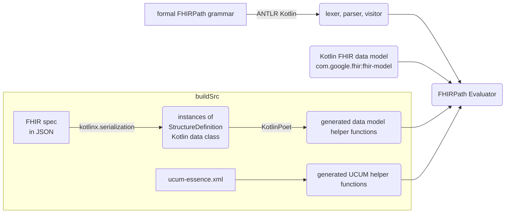

# Kotlin FHIRPath

[](https://guidelines.denpa.pro/stability#work-in-progress)

[](https://opensource.org/licenses/Apache-2.0)

Kotlin FHIRPath is an implementation of [HL7® FHIR®](https://www.hl7.org/fhir/overview.html)'s
[FHIRPath](https://hl7.org/fhirpath/N1/) on
[Kotlin Multiplatform](https://kotlinlang.org/docs/multiplatform.html).

**Warning:** The library is WIP. DO NOT USE.

## Key features

* Built with an [ANTLR](https://www.antlr.org/)-generated parser for strict adherence to the formal
  FHIRPath grammar
* Conforms strictly to the specification, with predictable and well-documented behavior
* Support for validation, conversion, and comparison between compatible
  [UCUM](http://unitsofmeasure.org/ucum.html) units
* Designed for portability, providing a single engine across JVM, Android, iOS, Web (JS), and Native
  platforms
* Tested against the official [FHIR test cases](https://github.com/FHIR/fhir-test-cases) to
  guarantee correctness

## FHIRPath version support

The implementation is based on the [FHIRPath Normative Release](https://hl7.org/fhirpath/N1/).
However, we also incorporate some of the latest features and clarifications from the
[Continuous Build](https://build.fhir.org/ig/HL7/FHIRPath/) wherever feasible. Please note the
experimental nature of the sections marked as STU (Standard for Trial Use) in the Continuous Build.

## FHIR version support

The library currently supports R4 only. Support for other versions will be added as the library
matures.

## Implementation

This project uses [ANTLR Kotlin](https://github.com/Strumenta/antlr-kotlin) to generate the
lexer, parser and visitor directly from the formal FHIRPath grammar. This automated approach ensures
correctness, improves maintainability, and significantly reduces development time.

The
[FHIRPath Evaluator](fhirpath/src/commonMain/kotlin/com/google/fhir/fhirpath/FhirPathEvaluator.kt)
implements the visitor class generated by ANTLR, evaluating FHIRPath expressions by traversing the
in-memory data model from the [Kotlin FHIR](https://github.com/google/kotlin-fhir) library.

A key requirement for FHIRPath evaluation is the capability to access data elements by name. To
achieve this with cross-platform compatibility (avoiding reflection), a codegen embedded in
`buildSrc` generates helper functions to the Kotlin FHIR data model.



*Figure 1: Architecture diagram*

The following table lists the chosen internal types for the FHIRPath primitive types.

| FHIRPath type  | Internal type  |
|-----------------------------------------------------------------------------|-------------------------------------------------------------------------------|
| Boolean                                                                     | kotlin.Boolean                                                                |
| String                                                                      | kotlin.String                                                                 |
| Integer                                                                     | kotlin.Int                                                                    |
| Long                                                                        | kotlin.Long                                                                   |
| Decimal                                                                     | kotlin.Double                                                                 |
| Date                                                                        | FhirDate(*)                                                                   |
| DateTime                                                                    | FhirPathDateTime(**)                                                          |
| Time                                                                        | FhirPathTime(**)                                                              |
| Quantity                                                                    | Quantity(*)                                                                   |

(*): Classes defined in [Kotlin FHIR](https://github.com/google/kotlin-fhir)
(**): Classes defined in this project

Classes from the [Kotlin FHIR](https://github.com/google/kotlin-fhir) are used for more complex
types that do not have direct representations in Kotlin. For DateTime and Time, the requirements in
FHIRPath are more lenient than in the FHIR specification. As a result, custom classes need to be
authored to handle cases where the minutes, seconds, or milliseconds are not present (allowed in
FHIRPath but not allowed in FHIR).

## Conformance

Due to the library's WIP status, not all test cases from the published official test suites are
passing. The failures are documented in the table below.

|              Test case               |     Root cause     | STU |                  Tracking issue / PR                   |                                                                                             Note                                                                                             |
|--------------------------------------|--------------------|-----|--------------------------------------------------------|----------------------------------------------------------------------------------------------------------------------------------------------------------------------------------------------|
| `testPolymorphismAsB`                | Test               |     | To be raised                                           | No error should be thrown according to [specification](https://hl7.org/fhirpath/#as-type-specifier).                                                                                         |
| `testDateTimeGreaterThanDate1`       | Specification/Test |     | To be raised                                           | Unclear in the specification whether the result should still be empty if two values have different precisions but the comparison can still be "certain" (e.g. 2025 is greater than 2024-01). |
| `testCollectionNotEqualEmpty`        | Test               |     | [PR](https://github.com/FHIR/fhir-test-cases/pull/244) | [Discussion](https://chat.fhir.org/#narrow/channel/179266-fhirpath/topic/testCollectionNotEqualEmpty/with/543927021).                                                                        |
| `testDecimalLiteralToInteger`        | Test               |     | To be raised                                           | The result should be true.                                                                                                                                                                   |
| `testStringIntegerLiteralToQuantity` | Specification/Test |     |                                                        | [Discussion](https://chat.fhir.org/#narrow/channel/179266-fhirpath/topic/Quantity.20and.20Decimal/near/543270110)                                                                            |
| `testQuantityLiteralWkToString`      | Specification/Test |     |                                                        | As above.                                                                                                                                                                                    |
| `testQuantityLiteralWeekToString`    | Specification/Test |     |                                                        | As above.                                                                                                                                                                                    |
| `testQuantity4`                      | Test               |     | [PR](https://github.com/FHIR/fhir-test-cases/pull/243) |                                                                                                                                                                                              |
| `testExists3`                        | Implementation     |     |                                                        | Equality of enum and string is not implemented.                                                                                                                                              |
| `testSubSetOf3`                      | Implementation     |     |                                                        |                                                                                                                                                                                              |
| `testQuantity9`                      | Implementation     |     |                                                        | Quantity multiplication is not implemented.                                                                                                                                                  |
| `testQuantity10`                     | Implementation     |     |                                                        | Quantity division is not implemented.                                                                                                                                                        |
| `testQuantity11`                     | Implementation     |     |                                                        | As above.                                                                                                                                                                                    |
| `testDistinct2`                      | Implementation     |     |                                                        | Function `descendants` is not implemented.                                                                                                                                                   |
| `testDistinct3`                      | Implementation     |     |                                                        | As above.                                                                                                                                                                                    |
| `testDistinct5`                      | Implementation     |     |                                                        | As above.                                                                                                                                                                                    |
| `testDistinct6`                      | Implementation     |     |                                                        | As above.                                                                                                                                                                                    |
| `testSelect3`                        | Implementation     |     |                                                        |                                                                                                                                                                                              |
| `testRepeat*`                        | Implementation     |     |                                                        | Function `repeat` is not implemented.                                                                                                                                                        |
| `testAggregate*`                     | Implementation     |     |                                                        | Function `aggregate` is not implemented.                                                                                                                                                     |
| `testIif10`                          | Implementation     |     |                                                        |                                                                                                                                                                                              |
| `testIif11`                          | Implementation     |     |                                                        |                                                                                                                                                                                              |
| `testReplace5`                       | Implementation     |     |                                                        |                                                                                                                                                                                              |
| `testReplace6`                       | Implementation     |     |                                                        |                                                                                                                                                                                              |
| `testEncode*`                        | Implementation     | STU |                                                        | Function `encode` is not implemented.                                                                                                                                                        |
| `testDecode*`                        | Implementation     | STU |                                                        | Function `decode` is not implemented.                                                                                                                                                        |
| `testEscape*`                        | Implementation     | STU |                                                        | Function `escape` is not implemented.                                                                                                                                                        |
| `testUnescape*`                      | Implementation     | STU |                                                        | Function `unescape` is not implemented.                                                                                                                                                      |
| `testTrace2`                         | Implementation     |     |                                                        |                                                                                                                                                                                              |
| `testNow1`                           | Specification/Test |     |                                                        | As `testDateTimeGreaterThanDate1`.                                                                                                                                                           |
| `testSort*`                          | Specification/Test |     |                                                        | Function `sort` is not defined in the specification.                                                                                                                                         |
| `testEquality20`                     | Implementation     |     |                                                        |                                                                                                                                                                                              |
| `testEquality21`                     | Implementation     |     |                                                        |                                                                                                                                                                                              |
| `testEquality22`                     | Implementation     |     |                                                        |                                                                                                                                                                                              |
| `testEquality23`                     | Implementation     |     |                                                        |                                                                                                                                                                                              |
| `testEquality28`                     | Implementation     |     |                                                        |                                                                                                                                                                                              |
| `testNEquality14`                    | Implementation     |     |                                                        |                                                                                                                                                                                              |
| `testNEquality15`                    | Implementation     |     |                                                        |                                                                                                                                                                                              |
| `testNEquality16`                    | Implementation     |     |                                                        |                                                                                                                                                                                              |
| `testNEquality17`                    | Implementation     |     |                                                        |                                                                                                                                                                                              |
| `testNEquality24`                    | Implementation     |     |                                                        |                                                                                                                                                                                              |
| `testEquivalent2`                    | Implementation     |     |                                                        |                                                                                                                                                                                              |
| `testEquivalent3`                    | Implementation     |     |                                                        |                                                                                                                                                                                              |
| `testEquivalent11`                   | Implementation     |     |                                                        |                                                                                                                                                                                              |
| `testEquivalent21`                   | Implementation     |     |                                                        |                                                                                                                                                                                              |
| `testEquivalent22`                   | Implementation     |     |                                                        |                                                                                                                                                                                              |
| `testEquivalent23`                   | Implementation     |     |                                                        |                                                                                                                                                                                              |
| `testNotEquivalent2`                 | Implementation     |     |                                                        |                                                                                                                                                                                              |
| `testNotEquivalent3`                 | Implementation     |     |                                                        |                                                                                                                                                                                              |
| `testNotEquivalent21`                | Implementation     |     |                                                        |                                                                                                                                                                                              |
| `testLessThan6`                      | Implementation     |     |                                                        |                                                                                                                                                                                              |
| `testLessThan13`                     | Implementation     |     |                                                        |                                                                                                                                                                                              |
| `testLessThan20`                     | Implementation     |     |                                                        |                                                                                                                                                                                              |
| `testLessThan22`                     | Implementation     |     |                                                        |                                                                                                                                                                                              |
| `testLessThan26`                     | Implementation     |     |                                                        |                                                                                                                                                                                              |
| `testLessOrEqual6`                   | Implementation     |     |                                                        |                                                                                                                                                                                              |
| `testLessOrEqual13`                  | Implementation     |     |                                                        |                                                                                                                                                                                              |
| `testLessOrEqual20`                  | Implementation     |     |                                                        |                                                                                                                                                                                              |
| `testLessOrEqual22`                  | Implementation     |     |                                                        |                                                                                                                                                                                              |
| `testLessOrEqual26`                  | Implementation     |     |                                                        |                                                                                                                                                                                              |
| `testGreaterOrEqual6`                | Implementation     |     |                                                        |                                                                                                                                                                                              |
| `testGreaterOrEqual13`               | Implementation     |     |                                                        |                                                                                                                                                                                              |
| `testGreaterOrEqual20`               | Implementation     |     |                                                        |                                                                                                                                                                                              |
| `testGreaterOrEqual22`               | Implementation     |     |                                                        |                                                                                                                                                                                              |
| `testGreaterOrEqual26`               | Implementation     |     |                                                        |                                                                                                                                                                                              |
| `testGreaterThan6`                   | Implementation     |     |                                                        |                                                                                                                                                                                              |
| `testGreaterThan13`                  | Implementation     |     |                                                        |                                                                                                                                                                                              |
| `testGreaterThan20`                  | Implementation     |     |                                                        |                                                                                                                                                                                              |
| `testGreaterThan22`                  | Implementation     |     |                                                        |                                                                                                                                                                                              |
| `testGreaterThan26`                  | Implementation     |     |                                                        |                                                                                                                                                                                              |
| `testGreaterThan6`                   | Implementation     |     |                                                        |                                                                                                                                                                                              |
| `testCombine*`                       | Implementation     |     |                                                        | Function `combine` is not implemented.                                                                                                                                                       |
| `testPlusDate*`                      | Implementation     |     |                                                        | Date time arithmetic not implemented.                                                                                                                                                        |
| `testMinus3`                         | Implementation     |     |                                                        |                                                                                                                                                                                              |
| `testMinus5`                         | Implementation     |     |                                                        |                                                                                                                                                                                              |
| `testMod4`                           | Implementation     |     |                                                        |                                                                                                                                                                                              |
| `testAbs3`                           | Implementation     |     |                                                        |                                                                                                                                                                                              |
| `testPrecedence3`                    | Implementation     |     |                                                        |                                                                                                                                                                                              |
| `testPrecedence4`                    | Implementation     |     |                                                        |                                                                                                                                                                                              |
| `testPrecedence6`                    | Implementation     |     |                                                        |                                                                                                                                                                                              |
| `testVariables*`                     | Implementation     |     |                                                        | Variables are not implemented.                                                                                                                                                               |
| `testExtension*`                     | Implementation     |     |                                                        | Function `extension` is not implemented.                                                                                                                                                     |
| `testType*`                          | Implementation     |     |                                                        | Function `type` is not implemented.                                                                                                                                                          |
| `testConformsTo*`                    | Implementation     |     |                                                        | Function `conformsTo` is not implemented.                                                                                                                                                    |
| `testLowBoundary*`                   | Implementation     | STU |                                                        | Function `testLowBoundary` is not implemented.                                                                                                                                               |
| `testHighBoundary*`                  | Implementation     | STU |                                                        | Function `testHighBoundary` is not implemented.                                                                                                                                              |
| `testComparable*`                    | Implementation     |     |                                                        | Function `testComparable` is not implemented.                                                                                                                                                |
| `testPrecision*`                     | Implementation     |     |                                                        | Function `precision` is not implemented.                                                                                                                                                     |
| `testIndex`                          | Implementation     |     |                                                        |                                                                                                                                                                                              |
| `testPeriod*`                        | Implementation     |     |                                                        |                                                                                                                                                                                              |
| `testFHIRPathIsFunction*`            | Implementation     |     |                                                        |                                                                                                                                                                                              |
| `testFHIRPathAsFunction*`            | Implementation     |     |                                                        |                                                                                                                                                                                              |
| `testContainedId`                    | Implementation     |     |                                                        |                                                                                                                                                                                              |

The root cause column documents if the test failure is caused by issues with the implementation
(this repository), the [tests](https://github.com/FHIR/fhir-test-cases), the specification itself,
or is under investigation. We exclude test cases that would fail due to issues in the tests and the
specification itself. But we track the ongoing discussions and resolutions in this table.

## User Guide

## Developer Guide

### ANTLR

To generate the lexer, parser, and visitor locally using ANTLR Kotlin:

```shell
./gradlew generateKotlinGrammarSource
```

The generated code will be placed in `fhirpath/build/generated` under package
`com.google.fhir.fhirpath.parsers`.

### Model extensions

To run the model extension codegen in `buildSrc` locally:

```shell
./gradlew generateR4Helpers
```

The generated code will be located in `fhirpath/build/generated` under packages
`com.google.fhir.fhirpath` and `com.google.fhir.fhirpath.ext`.

### UCUM helpers

To run the UCUM helper codegen in `buildSrc` locally:

```shell
./gradlew generateUcumHelpers
```

The generated code will be located in `fhirpath/build/generated` under package
`com.google.fhir.fhirpath.ucum`.

### Dependencies

Dependencies must be kept in sync between the
[`buildSrc/build.gradle.kts`](buildSrc/build.gradle.kts) file and the
[`gradle/libs.versions.toml`](gradle/libs.versions.toml) file. The former cannot use the latter
since the `buildSrc` directory is precompiled separately in Gradle.

### Tests

[XmlUtil](https://github.com/pdvrieze/xmlutil) is used to load the XML test cases from the
`third_party` directory. To run the tests:

```shell
./gradlew :fhirpath:jvmTest
```

The number of passing test cases is displayed on a badge at the top of this page.

### Third Party

The [third_party](third_party/) directory includes resources from the FHIRPath specification and related
repositories for code generation and testing purposes:

- [`fhir-test-cases`](third_party/fhir-test-cases/): content from the
  [fhir-test-cases](https://github.com/FHIR/fhir-test-cases) repo
  - [`tests-fhir-r4.xml`](third_party/fhir-test-cases/r4/tests-fhir-r4.xml): R4 test cases
    ([commit](https://github.com/FHIR/fhir-test-cases/blob/dc86fa6f5225ac27b42046bb3ba2254ff688d3df/r4/fhirpath/tests-fhir-r4.xml))
  - [`resources`](third_party/fhir-test-cases/r4/resources) JSON versions of the relevant test
    resources generated using [Anton V.](https://www.antvaset.com/)'s
    [FHIR Converter](https://www.antvaset.com/fhir-converter) alongside the XML versions
    ([commit](https://github.com/FHIR/fhir-test-cases/tree/dc86fa6f5225ac27b42046bb3ba2254ff688d3df/r4))
- [`fhirpath-2.0.0`](third_party/fhirpath-2.0.0/): the formal
  [antlr grammar](https://hl7.org/fhirpath/N1/grammar.html) from the FHIRPath Normative Release
  [N1 (v2.0.0)](https://hl7.org/fhirpath/N1/) including
- [`hl7.fhir.r4.core`](third_party/hl7.fhir.r4.core/): content from
  [FHIR R4](https://hl7.org/fhir/R4/) for code generation
- [`ucum`](third_party/ucum/): content from the [UCUM](https://github.com/ucum-org/ucum) repo

## Disclaimer

This is not an officially supported Google product. This project is not
eligible for the [Google Open Source Software Vulnerability Rewards
Program](https://bughunters.google.com/open-source-security).
