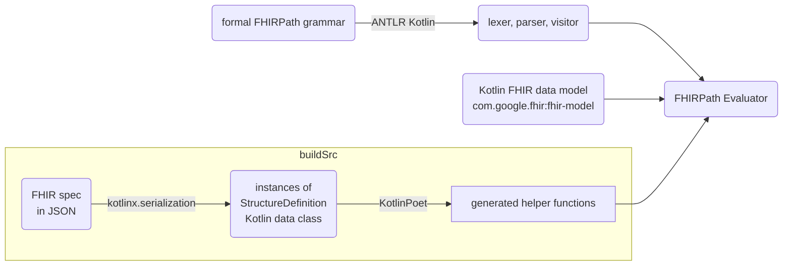

# Kotlin FHIRPath

[](https://guidelines.denpa.pro/stability#work-in-progress)

[](https://opensource.org/licenses/Apache-2.0)

Kotlin FHIRPath is an implementation of [HL7® FHIR®](https://www.hl7.org/fhir/overview.html)'s
[FHIRPath](https://hl7.org/fhirpath/N1/) on
[Kotlin Multiplatform](https://kotlinlang.org/docs/multiplatform.html).

**Warning:** The library is WIP. DO NOT USE.

## Implementation

This project uses [ANTLR Kotlin](https://github.com/Strumenta/antlr-kotlin) to generate the
lexer, parser and visitor directly from the formal FHIRPath grammar. This automated approach ensures
correctness, improves maintainability, and significantly reduces development time.

The
[FHIRPath Evaluator](fhirpath/src/commonMain/kotlin/com/google/fhir/fhirpath/FhirPathEvaluator.kt)
implements the visitor class generated by ANTLR, evaluating FHIRPath expressions by traversing the
in-memory data model from the [Kotlin FHIR](https://github.com/google/kotlin-fhir) library.

A key requirement for FHIRPath evaluation is the capability to access data elements by name. To
achieve this with cross-platform compatibility (avoiding reflection), a codegen embedded in
`buildSrc` generates helper functions to the Kotlin FHIR data model.


```mermaid
graph LR
    A(formal FHIRPath grammar) -- ANTLR Kotlin --> B(lexer, parser, visitor)
    C(Kotlin FHIR data model<br>com.google.fhir:fhir-model)
    subgraph buildSrc
        direction LRTB
        D(FHIR spec<br>in JSON) -- kotlinx.serialization --> E(instances of<br>StructureDefinition<br>Kotlin data class<br>)
        E -- KotlinPoet --> F[generated helper functions]
    end
    B --> G(FHIRPath Evaluator)
    C --> G
    F --> G
```

The following table lists the chosen internal types for the FHIRPath primitive types. Notice that
classes from the [Kotlin FHIR](https://github.com/google/kotlin-fhir) are used for more complex
types (e.g. Date, DateTime).

| FHIRPath type  | Internal type  |
|-----------------------------------------------------------------------------|-------------------------------------------------------------------------------|
| Boolean                                                                     | kotlin.Boolean                                                                |
| String                                                                      | kotlin.String                                                                 |
| Integer                                                                     | kotlin.Int                                                                    |
| Long                                                                        | kotlin.Long                                                                   |
| Decimal                                                                     | kotlin.Double                                                                 |
| Date                                                                        | com.google.fhir.model.r4.FhirDate                                             |
| DateTime                                                                    | com.google.fhir.model.r4.FhirDateTime                                         |
| Time                                                                        | kotlinx.datetime.LocalTime                                                    |
| Quantity                                                                    | com.google.fhir.model.r4.Quantity                                             |

## User Guide

## Developer Guide

### ANTLR

To generate the lexer, parser, and visitor locally using ANTLR Kotlin:

```shell
./gradlew generateKotlinGrammarSource
```

The generated code will be placed in `fhirpath/build/generatedAntlr`.

### Model extensions

To run the codegen in `buildSrc` locally:

```shell
./gradlew generateR4Helpers
```

The generated code will be located in `fhirpath/build/generated`.

### Tests

[XmlUtil](https://github.com/pdvrieze/xmlutil) is used to load the XML test cases from the
`third_party` directory. To run the tests:

```shell
./gradlew :fhirpath:jvmTest
```

The number of passing test cases is displayed on a badge at the top of this page.

### Third Party

The [third_party](third_party/) directory includes resources from the FHIRPath specification and related
repositories for code generation and testing purposes:
- [`fhir-test-cases`](third_party/fhir-test-cases/): content from the
[fhir-test-cases](https://github.com/FHIR/fhir-test-cases) repo
- [`tests-fhir-r4.xml`](third_party/fhir-test-cases/r4/tests-fhir-r4.xml): R4 test cases
([commit](https://github.com/FHIR/fhir-test-cases/blob/dc86fa6f5225ac27b42046bb3ba2254ff688d3df/r4/fhirpath/tests-fhir-r4.xml))
- [`resources`](third_party/fhir-test-cases/r4/resources) JSON versions of the relevant test
resources generated using [Anton V.](https://www.antvaset.com/)'s
[FHIR Converter](https://www.antvaset.com/fhir-converter) alongside the XML versions
([commit](https://github.com/FHIR/fhir-test-cases/tree/dc86fa6f5225ac27b42046bb3ba2254ff688d3df/r4))
- [`fhirpath-2.0.0`](third_party/fhirpath-2.0.0/): the formal
[antlr grammar](https://hl7.org/fhirpath/N1/grammar.html) from the FHIRPath Normative Release
[N1 (v2.0.0)](https://hl7.org/fhirpath/N1/) including
- [`hl7.fhir.r4.core`](third_party/hl7.fhir.r4.core/): content from
[FHIR R4](https://hl7.org/fhir/R4/) for code generation
